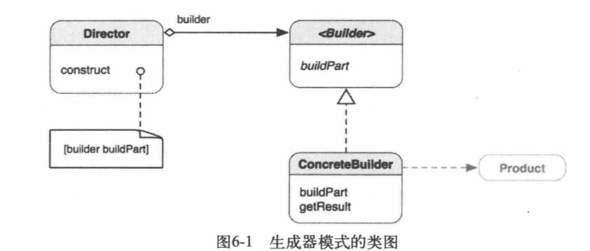
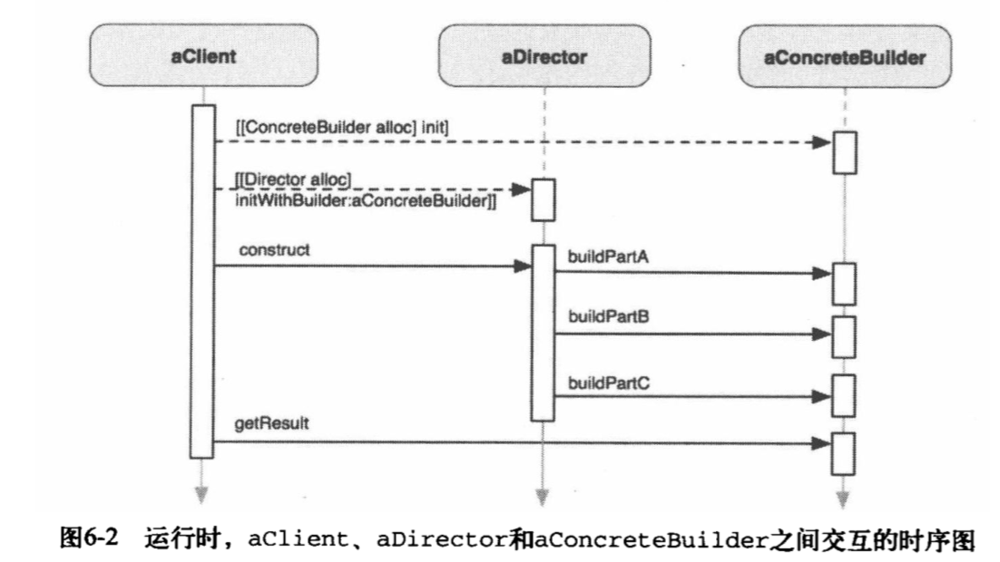

## 一、构造者模式简介

>**将一个复杂对象的构建与它的表示分离，使得同样的构建过程可以创建不同的表示。建造者模式是一种对象创建型模式。**





* Builder（抽象建造者）：它为创建一个产品Product对象的各个部件指定抽象接口，在该接口中一般声明两类方法，一类方法是buildPartX()，它们用于创建复杂对象的各个部件；另一类方法是getResult()，它们用于返回复杂对象。Builder既可以是抽象类，也可以是接口。

* ConcreteBuilder（具体建造者）：它实现了Builder接口，实现各个部件的具体构造和装配方法，定义并明确它所创建的复杂对象，也可以提供一个方法返回创建好的复杂产品对象。

* Product（产品角色）：它是被构建的复杂对象，包含多个组成部件，具体建造者创建该产品的内部表示并定义它的装配过程。

*  Director（指挥者）：指挥者又称为导演类，它负责安排复杂对象的建造次序，指挥者与抽象建造者之间存在关联关系，可以在其construct()建造方法中调用建造者对象的部件构造与装配方法，完成复杂对象的建造。客户端一般只需要与指挥者进行交互，在客户端确定具体建造者的类型，并实例化具体建造者对象，然后通过指挥者类的初始化函数或者Setter方法将该对象传入指挥者类中。


## 二、用来解决什么问题

想象一下，我们有个非常复杂的对象需要构造，这个复杂对象是指那些**包含多个成员属性的对象**，这些成员属性也称为部件或零件，如汽车包括方向盘、发动机、轮胎等部件，电子邮件包括发件人、收件人、主题、内容、附件等部件。接下来我们以汽车对象为例进行描述。如果想要构造一个汽车对象，那么就需要按照一定的步骤先将其内部的部件构造完毕，最终构造出一个完整的汽车对象，这个过程可能还会包含一些其他的逻辑判断。当**不使用**建造者模式的时候，汽车对象的构造可能就在某个类（客户端）当中进行，这个类集合了以下的一些职责：

* 选择创建一个什么样的汽车，奔驰还是奥迪？（存在大量逻辑判断）
* 按照一定的顺序构造一辆完整的汽车。
* 构造汽车的零部件并最终生成一辆汽车。

想做到这些，这个类必须知道所有的关于构造汽车的细节，很明显，这样的代码不容易复用，并且违反了**单一职责原则**。

建造者模式能够很容易的解决上述问题。

* 把**按一定的构造顺序构造汽车的职责**抽离到Director当中，由Director来判断将用什么样的构造顺序构造一个具体的对象。
* 把**构造零部件并生成一辆汽车的职责**抽离的Builder当中，Buiiler负责零部件具体的构造细节，并最终构造出一辆汽车。

经过职责的分离，现在客户端只需要知道，他想要一辆什么样的汽车，并将能够生产该汽车的Builder告知Director，Director内部就会使用这个Builder去按照一定的顺序构造出一辆客户端需要的汽车，并返回给客户端。

现在可以来看看这个模式解决了什么问题了：

1. 分离复杂对象构建的职责，隔离股咋对象的创建和使用。使得代码可复用，并且容易扩展。
2. 屏蔽一切客户端不需要知道的细节，暴露出客户端需要知道的接口。


## 三、使用场景

*  需要生成的产品对象有**复杂的内部结构**，这些产品对象通常**包含多个成员属性**。

*  需要生成的产品**对象的属性相互依赖**，需要指定其生成顺序。

* 对象的**创建过程**独立于创建该对象的类。在建造者模式中通过引入了指挥者类，将创建过程封装在指挥者类中，而不在建造者类和客户类中。
* 隔离复杂对象的创建和使用，并使得相同的创建过程可以创建不同的产品。


## 四、使用实例

LOL当中英雄众多，但他们都有一些共有的属性，如发型，身体，武器等等。这些英雄的构造顺序大同小异，加入我们现在要构造两个英雄，蛮王和皇子（玩过英雄联盟的人应该都知道这两个英雄）。

通过建造者模式，我们将这两个英雄的构造顺序放到Director当中，将其命名为**HeroBuildDirector**。具体的构造细节（发型，身体，武器）放入两个不同的Builder当中，我将他们分别命名为**ManBuilder**和**HuangBuilder**，这两个Builder都实现了公共的Builder接口。通过**HeroBuildDirector**的构造顺序，生产出来叫做**Hero**的产品（Product）。现在，客户端只需要将合适的Builder传给Director即可得到想要的英雄。客户端的代码最终应该如下：


```objc
Builder *builder = [[ManBuilder alloc] init];//蛮王的构造者
HeroBuildDirector *director = [[HeroBuildDirector alloc] initWithHeroBuilder:builder];
Hero *hero = [director construct];
```

