## 面向对象设计原则概述

### 一、综述

如何同时提高一个软件系统的**可维护性**和**可复用性**是面向对象设计需要解决的核心问题之一。在面向对象设计中，可维护性的复用是以**设计原则**为基础的。

**面向对象设计原则为支持可维护性复用而诞生，这些原则蕴含在很多设计模式中，它们是从许多设计方案中总结出的指导性原则**。

​								 **7种常用的面向对象设计原则**

| **设计原则名称**                                   |                    **定  义**                    | **使用频率** |
| -------------------------------------------------- | :----------------------------------------------: | ------------ |
| 单一职责原则(Single Responsibility Principle, SRP) |       一个类只负责一个功能领域中的相应职责       | ★★★★☆        |
| 开闭原则(Open-Closed Principle, OCP)               |        软件实体应对扩展开放，而对修改关闭        | ★★★★★        |
| 里氏代换原则(Liskov Substitution Principle, LSP)   | 所有引用基类对象的地方能够透明地使用其子类的对象 | ★★★★★        |
| 依赖倒转原则(Dependence  Inversion Principle, DIP) |     抽象不应该依赖于细节，细节应该依赖于抽象     | ★★★★★        |
| 接口隔离原则(Interface Segregation Principle, ISP) |     使用多个专门的接口，而不使用单一的总接口     | ★★☆☆☆        |
| 合成复用原则(Composite Reuse Principle, CRP)       |   尽量使用对象组合，而不是继承来达到复用的目的   | ★★★★☆        |
| 迪米特法则(Law of Demeter, LoD)                    | 一个软件实体应当尽可能少地与其他实体发生相互作用 | ★★★☆☆        |

### 二、单一职责原则

**单一职责原则(Single Responsibility Principle, SRP)：一个类只负责一个功能领域中的相应职责，或者可以定义为：就一个类而言，应该只有一个引起它变化的原因。**

单一职责原则是实现**高内聚、低耦合**的指导方针，它是最简单但又最难运用的原则。

**运用实例**

重构前：

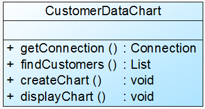

重构后：

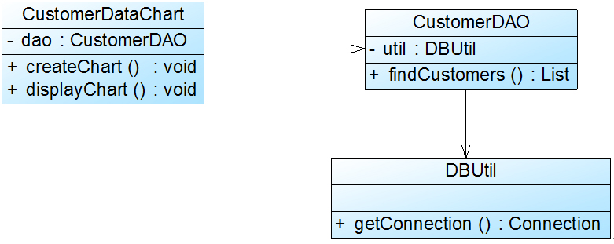

### 三、开闭原则

**开闭原则(Open-Closed Principle, OCP)：一个软件实体应当对扩展开放，对修改关闭。即软件实体应尽量在不修改原有代码的情况下进行扩展。** 

如果一个软件设计符合开闭原则，那么可以非常方便地对系统进行扩展，而且在扩展时无须修改现有代码，使得软件系统在拥有适应性和灵活性的同时具备较好的稳定性和延续性。

为了满足开闭原则，需要对系统进行抽象化设计，**抽象化是开闭原则的关键**。

**运用实例**

重构前:

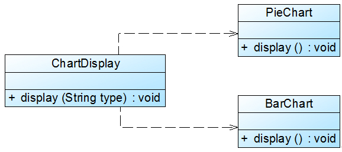

重构后：

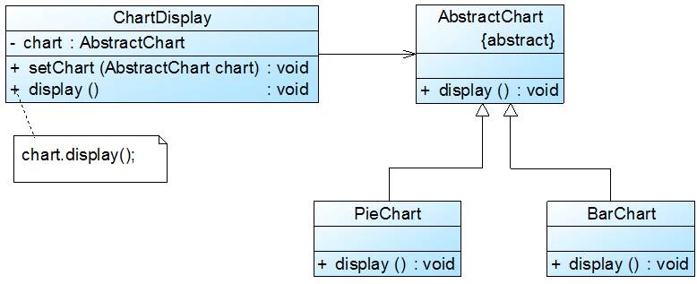

### 四、里氏代换原则

**如果对每一个类型为S的对象o1，都有类型为T的对象o2，使得以T定义的所有程序P在所有的对象o1代换o2时，程序P的行为没有变化，那么类型S是类型T的子类型。**	

里氏代换原则告诉我们：

>在软件中将一个基类对象替换成它的子类对象，程序将不会产生任何错误和异常，反过来则不成立，如果一个软件实体使用的是一个子类对象的话，那么它**不一定**能够使用基类对象。

里氏代换原则是实现开闭原则的重要方式之一，由于使用基类对象的地方都可以使用子类对象，因此**在程序中尽量使用基类类型来对对象进行定义，而在运行时再确定其子类类型，用子类对象来替换父类对象**。

在使用里氏代换原则时需要注意如下几个问题:

* 子类的所有方法必须在父类中声明，或子类必须实现父类中声明的所有方法。
* 我们在运用里氏代换原则时，尽量把父类设计为**抽象类或者接口**，让子类继承父类或实现父接口，并实现在父类中声明的方法，运行时，子类实例替换父类实例，我们可以很方便地扩展系统的功能，同时无须修改原有子类的代码，增加新的功能可以通过增加一个新的子类来实现。 

**运用实例**

重构前：

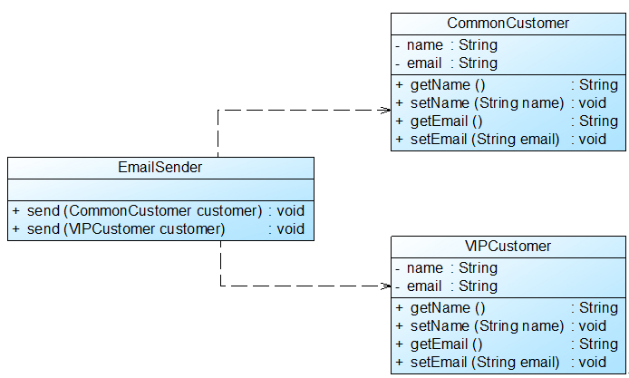

重构后：

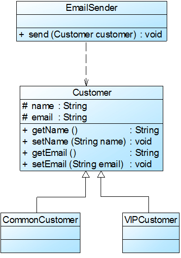

### 五、依赖倒转原则

**依赖倒转原则(Dependency Inversion  Principle, DIP)：抽象不应该依赖于细节，细节应当依赖于抽象。换言之，要针对接口编程，而不是针对实现编程。**

依赖倒转原则要求我们在程序代码中**传递参数时**或**在关联关系中**，尽量引用层次高的抽象层类，即使用接口和抽象类进行**变量类型声明**、**参数类型声明**、**方法返回类型声明**，**以及数据类型的转换**等，而不要用具体类来做这些事情。

 在实现依赖倒转原则时，我们需要针对抽象层编程，而将具体类的对象通过**依赖注入(DependencyInjection, DI)**的方式注入到其他对象中，**依赖注入是指当一个对象要与其他对象发生依赖关系时，通过抽象来注入所依赖的对象**。常用的注入方式有三种，分别是：**构造注入，设值注入（Setter注入）和接口注入**。

**运用实例**

重构前：

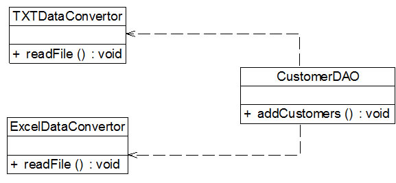

重构后：

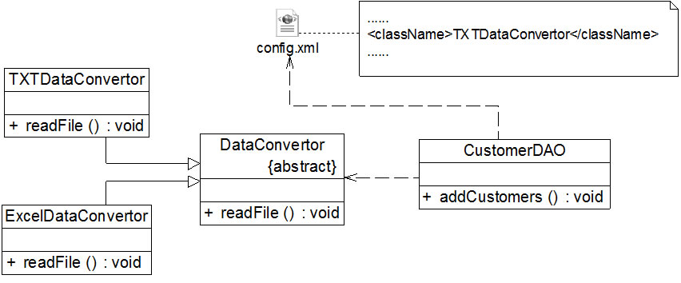

### 六、接口隔离原则

**接口隔离原则(Interface  Segregation Principle, ISP)：使用多个专门的接口，而不使用单一的总接口，即客户端不应该依赖那些它不需要的接口。**

根据接口隔离原则，当一个接口太大时，我们需要将它分割成一些更细小的接口，使用该接口的客户端仅需知道与之相关的方法即可。

这里的“接口”往往有两种不同的含义：

* 一种是指一个类型所具有的方法特征的集合，仅仅是一种逻辑上的抽象；
* 另外一种是指某种语言具体的“接口”定义，有严格的定义和结构，比如Java语言中的interface。

**运用实例**

重构前

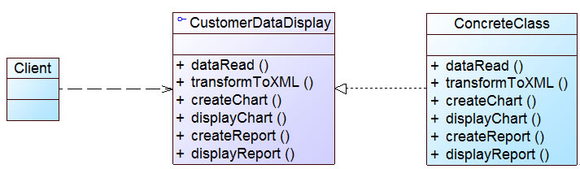

重构后

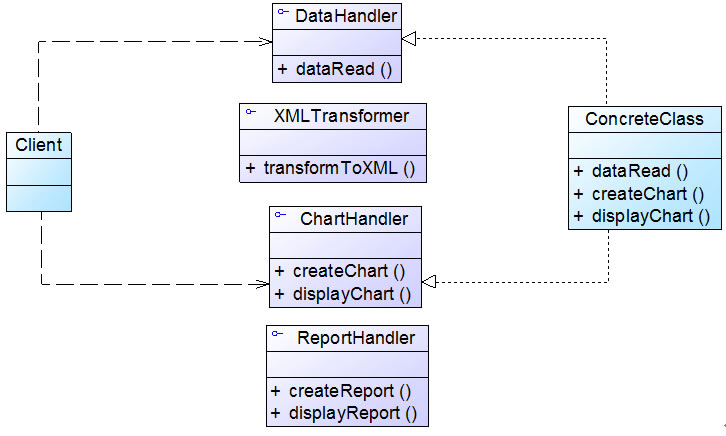

 **在使用接口隔离原则时，我们需要注意控制接口的粒度，接口不能太小，如果太小会导致系统中接口泛滥，不利于维护；接口也不能太大，太大的接口将违背接口隔离原则，灵活性较差，使用起来很不方便。**

### 七、复用原则

**合成复用原则(Composite Reuse Principle, CRP)：尽量使用对象组合，而不是继承来达到复用的目的。**

**复用时要尽量使用组合/聚合关系（关联关系），少用继承**。

>组合/聚合可以使系统更加灵活，降低类与类之间的耦合度，一个类的变化对其他类造成的影响相对较少；
>
>在使用继承时，需要严格遵循里氏代换原则，有效使用继承会有助于对问题的理解，降低复杂度，而滥用继承反而会增加系统构建和维护的难度以及系统的复杂度，因此**需要慎重使用继承复用**

通过继承来进行复用的主要问题在于继承复用会**破坏系统的封装性**，因为继承会将基类的实现细节暴露给子类.

如果两个类之间是“Has-A”的关系应使用组合或聚合，如果是“Is-A”关系可使用继承。

**运用实例**

重构前：

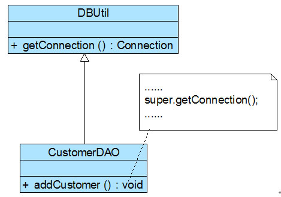

重构后：

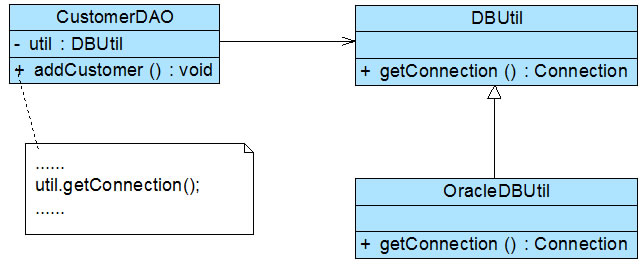

### 八、迪米特法则

迪米特法则又称为最少知识原则(LeastKnowledge Principle, LKP)。

**迪米特法则(Law of  Demeter, LoD)：一个软件实体应当尽可能少地与其他实体发生相互作用。**

**应该尽量减少对象之间的交互，如果两个对象之间不必彼此直接通信，那么这两个对象就不应当发生任何直接的相互作用，如果其中的一个对象需要调用另一个对象的某一个方法的话，可以通过第三者转发这个调用**。简言之，就是**通过引入一个合理的第三者来降低现有对象之间的耦合度**。

在将迪米特法则运用到系统设计中时，要注意下面的几点：**在类的划分上，应当尽量创建松耦合的类，类之间的耦合度越低，就越有利于复用，一个处在松耦合中的类一旦被修改，不会对关联的类造成太大波及**；**在类的结构设计上，每一个类都应当尽量降低其成员变量和成员函数的访问权限**；**在类的设计上，只要有可能，一个类型应当设计成不变类**；**在对其他类的引用上，一个对象对其他对象的引用应当降到最低**。

**运用实例**

重构前：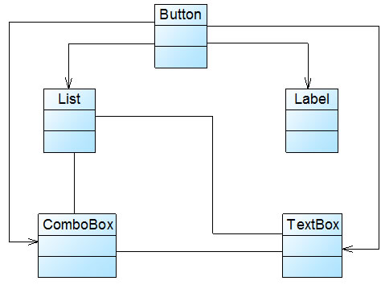

重构后：

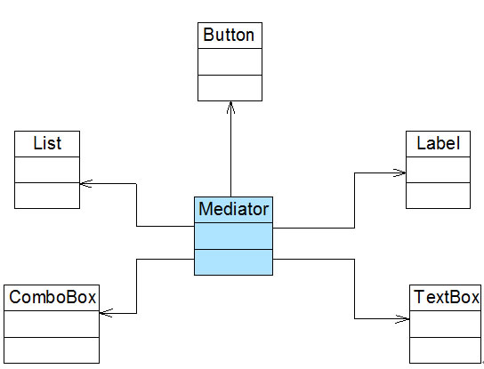