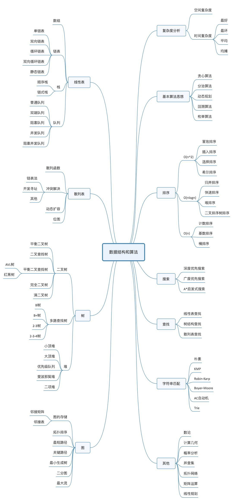

#基本概念及术语

>数据结构是一门研究非数值计算的程序设计问题中的操作对象，以及他们之间的关系和操作等相关问题的学科。

* 数据  
数据是描述客观事物的符号，是计算机中可以操作的对象，是能被计算机识别，并输入给计算机处理的符号集合。  

* 数据元素  
数据元素是组成数据的、有一定意义的基本单位，在计算机中通常作为整体处理。也被称为记录。  

* 数据项  
一个数据元素可以由若干个数据项组成。  

* 数据对象  
数据对象是**性质相同**的数据元素的集合，是数据的子集。

* 数据结构  
数据结构是相互之间存在一种或多种特定关系的数据元素的集合。

* 逻辑结构  
是指数据对象中，数据元素之间的相互关系。  

* 物理结构  
是指数据的逻辑结构在计算机中的存储形式。  

* 数据类型  
数据类型是指一组性质相同的值的集合及定义在此集合上的一些操作的总称。  

* 抽象数据类型  
是指一个数学模型及定义在该模型上的一组操作。

#一、算法
>算法是解决特定问题求解步骤的描述，在计算机中表现为指令的有限序列，并且每条指令表示一个或多个操作。

##算法的特征

* 输入输出
* 有穷性
* 确定性
* 可行性

##算法设计的要求

* 正确性
	* 没有语法错误
	* 合法的输入数据能够产生满足要求的输出结果。
	* 非法的输入数据能够得出满足规格说明的结果。
	* 对于精心选择的，设置刁难的测试数据都有满足要求的输出结果。
	* 
* 可读性
* 健壮性
* 时间效率高和存储量低

##算法效率的度量方法  
### 事后统计方法
基本不用考虑
### 事前分析估算

> 在计算机程序编制前，一句统计方法对算法进行估算。  
> 高级程序语言编写的程序在计算机上运行时消耗的时间取决于下列因素：
> 
> * 算法采用的策略、方法
> * 编译缠身的代码质量
> * 问题的输入规模
> * 机器执行指令的速度
> 
>**测定运行时间最可靠的方法就是计算对运行时间有消耗的基本操作的执行次数。**

在分析一个算法的运行时间是，重要的是`把基本操作的数量与输入规模关联起来，即基本操作的数量必须表示成输入规模的函数`。

##算法的时间复杂度
> 在进行算法分析时，语句总的执行次数T(n)是关于问题规模n的函数，进而分析T(n)随n的变化情况并确定T(n)的数量级。算法的时间复杂度，也就是算法的时间量度，记做T(n)= O(f(n))。它表示随问题规模n的增大，算法执行时间的增长率和f(n)的增长率相同，称作算法的渐进时间复杂度，简称为时间复杂度。其中f(n)是问题规模n的某个函数。

####常见的时间复杂度
~~~
O(1) < O(logn) < O(n) < O(nlogn) < O(n^2) < O(n^3) < O(2^n) < O(n!) < O(n^n)
~~~

#二、线性表
>零个或多个数据元素的**有限**序列**（有序数列）**。 

## 线性表的抽象数据类型
~~~
ADT 线性表（List)
Data
	线性表的数据对象结合为{a1,a2,a3...an},每个元素的类型均为DataType。其中，除第一个元素外，每一个元素都有且只有一个直接前驱元素，除了最后一个元素外，每一个元素有且只有一个直接后继元素。数据元素之间的关系是一对一的关系
Operation
	InitList(*L):初始化操作，建立一个空的线性表L。
	ListEmpty(L):若线性表为空，返回true，反之返回false。
	ClearList（*L):将线性表清空。
	GetElem(L,i,*e):将线性表L中的第i个位置元素返回给e。
	LocateElem(L,e):查找与e相等的元素,找到则返回其在线性表中的序号，否则返回0。
	ListInsert(*L,i,e):在线性表L中的第i个位置插入新元素e。
	ListDelete(*L,i,*e):删除表中第i个位置的元素，并用e返回其值。
	ListLength(L):返回线性表L的元素个数。
endADT
~~~
##线性表的顺序存储结构

线性表链式存储结构的优点：  

* 无须为表示表中元素之间的逻辑关系而增加额外的存储空间
* 可以快速的存取表中任意位置的元素。

线性表链式存储结构缺点：

* 插入和删除操作需要移动大量元素
* 当线性表长度变化较大时，难以确定存储空间的容量
* 造成存储空间的“碎片”

##线性表的链式存储结构

###结点  
把存储数据元素信息的域称为数据域，把存储直接后继位置的域称为指针域。指针域中存储的信息称作指针或链。这两部分信息醉成数据元素的存储映像，成为结点。  

###链表  
n个结点链结成一个链表，即为线性表的链式存储结构。  

###头指针  
链表中第一个结点的存储位置叫做头指针。  

###头结点 
有时，会在单链表的第一个结点前附设一个结点，称为头结点。头结点的数据域可以不存储任何信息，头结点的指针域存储指向第一个结点的指针（注意：这个指针不是头指针，此时，指向头结点的指针才是头指针）。

##单链表结构和顺序存储结构的优缺点
###存储分配方式
* 顺序存储结构用一段连续的存储单元一次存储线性表的数据元素。
* 单链表采用链式存储结构，用一组任意的存储单元存放线性表的元素。

###时间性能
* 查找
	* 顺序存储结构-O(1)
	* 单链表-O(n)
* 插入和删除
	* 顺序存储结构需要平均移动表厂一半的元素，时间为O(n)。
	* 单链表在线出某位置的指针后，插入和删除是时间仅为O(1)。
* 空间性能
	* 顺序存储结构需要预分配存储空间，分大了，浪费，分校了易发生上溢。
	* 单链表不需要分配存储空间，只要有就可以分配，元素个数也不受限制。

> 综上
> 
> * 若线性表需要频繁的查找，很少进行插入和删除操作，宜采用**顺序存储结构**。若需要频繁插入和删除，宜采用单链表结构。
> * 当线性表中的元素个数变化较大或者根本不知道有多大时，最好采用单链表结构，这样可以不需要考虑存储空间大小的问题。

## 循环链表
> 将单链表的终端结点的指针端由空指针改为指向头结点，就使整个单链表形成一个环，这种头尾详解的单链表成为单循环链表，简称循环链表

## 双向链表
> 双向链表是在单链表的每个结点中，再设置一个指向前驱结点的指针域。所以在双向链表的每个结点中有两个指针域，一个指向直接后继，一个指向直接前驱。  

# 三、栈与队列
> **栈**是仅限定在**表尾**进行**插入**和**删除**操作的**线性表**。   
> **队列**是只允许在一端进行**插入**操作、而在另一端进行**删除**操作的**线性表**。

## 栈的定义
**栈是仅限定在表尾进行插入和删除操作的线性表，又称后进先出的线性表，简称LIFO结构**。  

* 栈顶：把允许进行插入和删除的一端叫做栈顶。  
* 栈底：栈顶的另一端。  
* 空栈：不含任何数据元素的栈。  

## 栈的抽象数据类型

~~~
ADT 栈（stack）
Data
	与线性表相同。元素具有相同的类型，相邻元素具有前驱和后继关系。  
Operation
	InitStack(*S):初始化操作，建立一个空栈。
	DestroyStack(*S):若栈存在，销毁他。
	ClearStack(*S):清空栈。
	StackEmpty(S):空栈返回true，否则返回false。
	GetTop(S,*e):用e返回栈顶元素。
	Push(*S,e):若栈存在，在栈顶插入数据元素e，并视为栈顶元素。
	Pop(*S,e):删除栈顶元素，并用e返回其值。
	StackLength(S):返回栈S的长度。
endADT
~~~

## 栈的顺序存储结构
既然，栈是线性表的一种特例，那么栈的顺序存储其实也是线性表顺序存储的简化，简称为**顺序栈**。  

###  栈的顺序存储的缺陷
必须事先确定存储空间的大小，万一不够用了就要用编程手段来扩展数组容量，非常麻烦。  

###	两栈共享空间
对于一个栈，我们也只能尽量考虑周全，设计出合适的大小的数组来处理。但是，对于两个相同类型的栈，我们却可以做到最大限度的利用其事先开辟的存储空间来进行操作。  思想在于：**用一个数组来存储两个栈**，其他的都是为这个思想而使用的技巧。  

事实上，使用这样的数据结构，通常都是当两个站的控件需求有相反关系是，也就是一个栈增长时，另一个在缩短的情况。并且，这种共享空间的设计知识针对**两个具有相同数据类型的栈**的一个设计上的技巧，如果不是相同数据类型的栈，这种办法反而南辕北辙。

##  栈的链式存储结构
栈的链式存储结构称为**链栈**。  

注意事项  

* 栈顶放在链表的头部，让栈顶指针和头指针合二为一。  
* 通常来说，链栈不需要头结点。
* 链栈基本不存在栈满的情况，除非内存已经没有可以使用的空间。
* 链栈的操作绝大部分都和单链表类似，只是在**插入和删除**上，特殊一些。
* 链栈的空其实就是top=NULL。

##  栈的两种物理结构对比

###  时间复杂度
没有循环，时间复杂度均为O(1)。  

###  空间性能
顺序栈需要实现确定一个固定的长度，可能会存在内存空间浪费的问题，但他的优势是存取是定位很方便。  
链栈需要每个元素都有指针域，这同时也增加了一些内存开销，但对于栈的长度没有限制。  

###  结论
他们的区别和线性表中讨论的一样，如果栈的使用过程中元素变化不可预料，有时很小，有时非常大，那么最好用链栈；反之，如果他的变化在可控范围内，建议使用顺序栈会更好一些。

## 栈的作用
思想：栈的引入**简化了程序设计**的问题，划分了不同管住层次，是的思考范围缩小，更加聚焦于我们要解决的问题的核心。反之，像数组等，因为要分散精力去考虑数组的小标增减等细节问题，反而掩盖了问题的本质。

##栈的应用
###  1.递归
#### 什么是递归？  
在高级语言中，调用自己和其他函数并没有**本质**的不同。我们把一个直接调用自己或通过一系列的调用语句间接地调用自己的函数，称作递归函数。  

#### 递归与迭代的区别？  

* 迭代使用的是循环结构，递归使用的是选择结构。
* 递归能使程序的结构更清晰、更简洁、更容易让人理解，从而减少读懂代码的时间。
* 赌鬼会简历函数的副本，耗费大量的时间和内存。
* 迭代则不需要反复调用函数和占用额外的内存。

#### 递归与栈的关系？  
递归过程退回的顺序是它前行顺序的逆序。在退回过程中，可能要执行某些动作，包括回复在前行过程中存储起来的某些数据。这种存储某些数据，并在后面又以存储的逆序恢复这些数据，以提供之后使用的需求，显然很符合栈这样的数据结构，因此，编译器使用栈实现递归。  

## 队列的定义
**队列是只允许在一端进行插入操作，而在另一端进行删除操作的线性表，是一种先进先出的线性表，简称FIFO。允许插入的一端称为队尾，允许删除的一端称为队头。**

##队列的抽象数据类型

~~~
ADT 队列（Queue)
Data
	同线性表相同。元素具有相同的类型，相邻元素具有前驱和后继关系。
Operation
	InitQueue(*Q):初始化操作，间列一个空队列Q。
	DestroyQueue(*Q):若队列存在，将其销毁。
	ClearQueue(*!):将队列清空。
	QueueEmpty(Q):若队列为空，返回true，否则返回false。
	GetHead(Q,*e):若队列存在且非空，用e返回队列Q的队头元素。
	EnQueue(*Q,e):若队列存在，插入新元素e到队列Q中并成为队尾元素。
	DeQueue(*Q,*e):删除队列Q中队头元素，并用e返回其值。
	QueueLength(Q):返回队列Q的元素个数。
endADT
~~~

循环队列长度通用计算公式：  
（rear - front + QueueSize) % QueueSize

#四、串

##  1.串的定义
> 串是由零个或者多个字符组成的有限序列，又名叫字符串。  
> 一般记为s="a1a2a3......an"(n>=0),其中，s是串的名称，用双引号括起来的字符序列是串的值，注意：引号不属于串的内容。ai（1<=i<=n)可以是字母、数字或其他字符，i就是该字符在串中的位置。串中的字符数目n成为串的长度，定义中谈到**有限**是指长度n是一个有限的数值。**零个字符的串称为空串**，它的长度为0，可以直接用两双引号“”表示，也可以用希腊字母来表示。所谓序列，说明串的相邻字符之间具有前驱和后继的关系。 

### 相关概念
* 空格串：是只包含空格的串。
* 子串与主串：串中任意个数的连续字符组成的子序列称为该串的子串，相应地，包含子串的串称为主串。
* 子串在主串中的位置就是子串的第一个字符在主串中的序号。

## 2.串的抽象数据类型
~~~
ADT 串（string）
Data
	串中语速仅有一个字符组成，相邻元素具有前驱和后继关系。
Operation
	StrAssign(T,*chars):生成一个与chars相等的字符串常亮T。
	StrCopy(T,S):串S存在，由串S赋值得串T。
	ClearString(S):串S存在，将串清空。
	StringEmpty(S):判断串是否为空。
	StrLength(S):返回串S的元素个数，即串的长度。
	StrCompare(S,T):若S>T,返回值>0,若S=T,返回0，若S<T,返回值<0。
	Concat(T,S1,S2):用T返回由S1和S2联结而成的新串。
	SubString(Sub,S,pos,len):串S存在，1<=pos<=StrLength(S),且  
							 0<=len<=StrLength(S)-pos+1,用Sub返回
							 串S的第pos个字符起长度为len的子串。
	Index(S,T,pos):串S和T存在，T是非空串，1<=pos<=StrLength(S)。
				   若主串S中存在和串T值相同的子串，则返回它在主串S
				   中第pos个字符之后第一次出现的位置，否则返回0。
	Replace(S,T,V):串S、T和V存在，T是非空串。用V替换主串S中出现的所有与T
				   相等的不重叠的子串。
	StrInsert(S,pos,T):串S和T存在，1<=pos<=StrLength(S)+1。在串S的第
					   pos个字符之前插入串T。
	StrDelete(S,pos,len):串S存在，1<=pos<=StrLength(S)-len+1。从串S
						 中删除第pos个字符起长度为len的子串。
	
~~~

Index的实现算法

~~~
int Index(String S,String T,int pos)
{
	int n,m,i;
	String sub;
	if(pos > 0)
	{
		n = StrLength(S);
		m = StrLength(T);
		i = pos;
		while(i <= n - m +1)//注意这个位置的循环判断
		{
			SubString(sub,S,i,m);
			
			if(StrCompare(sub,T) != 0)
				++i;
			else
				return i;
		}
	}
}
~~~
## 3.串的存储结构
### 3.1.串的顺序存储结构
串的顺序存储结构是用一组地址连续的存储单元来存储串中的字符序列的。按照预定义的大小，为每个定义的串变量分配一个固定长度的存储区。一般是用定长数组来定义。   
由于字符串使用定长数组来定义的，这里就会存在一些问题。由于字符串的操作，比如两个串的连接Concat、新串的插入StrInsert，以及字符串的替换Replace都有可能使得字符串的长度超过预期的数组长度MaxSize。于是，对于串的顺序存储，有一些变化，串值的存储空间可在程序执行过程中动态分配。比如在计算机中存在一个自由存储区，叫做“堆”。这个堆可以由C语言的动态分配函数malloc()和free()来管理。
### 3.2串的链式存储结构

# 五、树
##1.树的定义
树是n个结点的有限集。n=0
