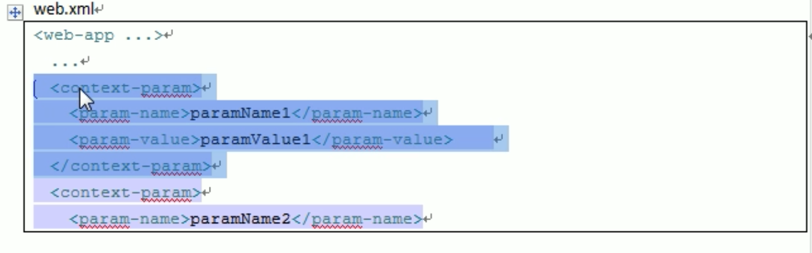
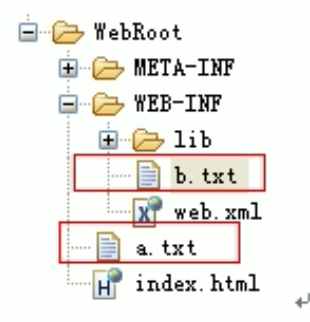
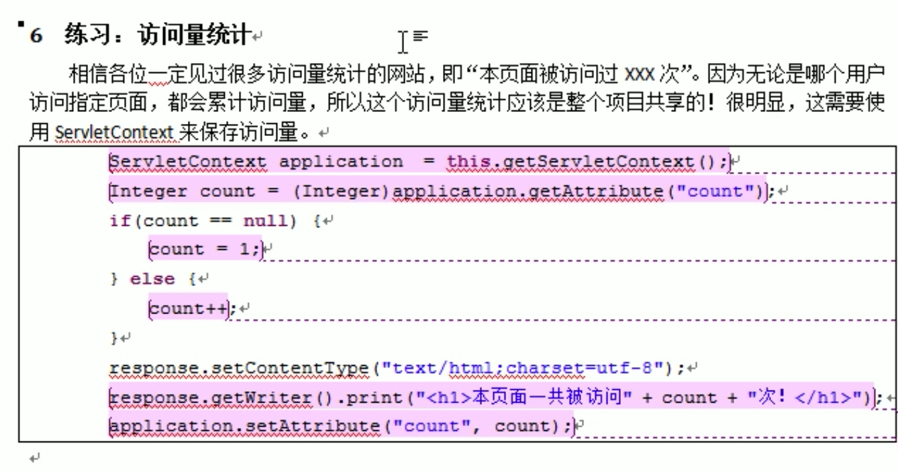
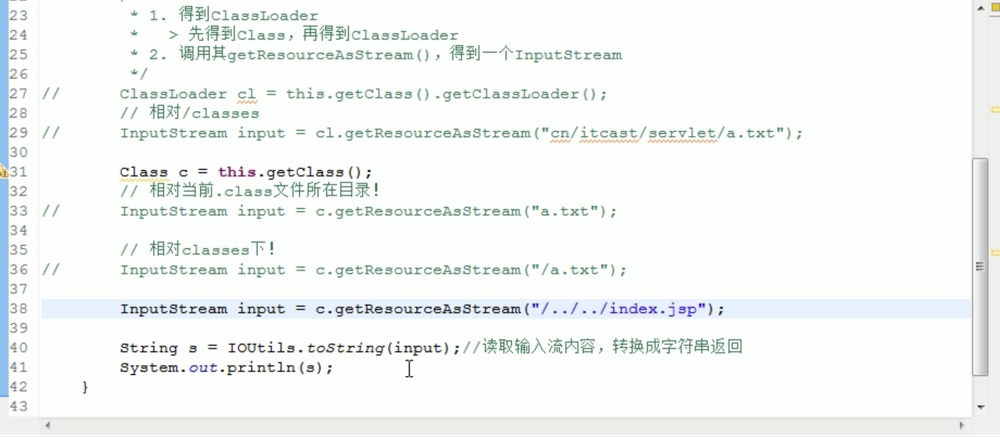
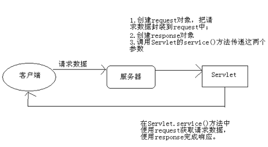

## 1 软件系统体系结构

* C/S 客户端服务器结构。    需要安装客户端程序，比较安全。
* B/S 浏览器服务器结构。  只需编写服务器程序，无需安装客户端，不安全。 

## 2.web资源

* HTML 静态资源-浏览器能够看得懂
* jsp/Servlet 动态资源-需要先转换成HTML，再给浏览器


## 3 Web服务器

回应客户端的请求。

### TomCat

??JAVA HOME 有什么用？

TomCat是web容器的意思是什么？

- bin：二进制执行文件。里面最常用的文件是**startup.bat**，如果是 Linux 或 Mac 系统启动文件为 **startup.sh**。
- conf:配置目录。里面最核心的文件是**server.xml**。可以在里面改端口号等。默认端口号是8080，也就是说，此端口号不能被其他应用程序占用。
- lib：库文件。tomcat运行时需要的jar包所在的目录
- logs：日志
- temp：临时产生的文件，即缓存
- webapps：web的应用程序。**web应用放置到此目录下浏览器可以直接访问**
- work：编译以后的class文件。

## 4 Web应用

静态网站：

1. 在webapps下创建一个项目目录。
2. 在项目目录下，创建一个HTML文件。

动态网站：

1. 在webapp下创建一个项目目录。
2. 在项目目录下创建如下内容：
   1. WEB-INF 目录
      1. 在WEB-INF目录下创建web.xml文件（他的内容可以去其他项目中借鉴）
   2. 创建静态或者动态界面


## 5 HTTP协议

协议的双方就是客户端和服务器。理解双方的通信的格式。

* 请求协议
* 响应协议


#### 请求协议

Content type : application/x-www-form-urlencode - form-表单提交的内容，中文会被自动编码（注意：**不是字符编码**），因为中文在网络当中传输容易丢失字节。

表单是一大堆内容，实际上发送给服务器的只有一个字符串。

Referer : http:/baidu.com -表示请求来3哪个页面。如从百度点击一个链接，到另一个页面，这个字段的值就是baidu.com.在地址栏当中发出的请求没有这个字段。 

> 可用于做防盗链。

#### 响应协议

响应头：

**告诉服务器不要缓存的响应头**

Expires: -1 

Cache-Control:no cache

Pragma:no-cache

**自动刷新响应头，浏览器3秒后再次请求**

Refresh: 3;url=http://www.baidu.com

响应码：

* 302

 重定向。表示服务器要求浏览器重新再发一个请求，并在响应头中给浏览器增加一个响应头：location，它指定了新的请求的URL地址。

* 304 

1. 浏览器第一次请求服务器，服务器在响应头当中返回一个**Last-Modified**，表示返回的HTML文件最近的一次的修改时间
2. 浏览器把这个HTML文件以及最后修改的时间缓存在硬盘上。
3. 浏览器第二次请求服务器，请求头当中包含了if-Modified-SInce,表示浏览器当中缓存的那个HTML文件的最后修改时间，经服务器判断，在服务器上的HTML文件的最后修改时间与浏览器缓存的是一致的，返回302状态码，就不再返回那个HTML文件。


#### HTML中指定响应头

使用**meta**标签。一个meta标签可以模拟一个响应头。

## 6 Servlet（服务器端的一个小程序）

### 6.1 什么是Sevlet

Servlet是JavaWeb的**三大组件之一**（Sevlet，Filter，listener），它属于动态资源，他的主要作用是处理请求，服务器会把接收到的请求交给Servlet处理，在Servelet中通常需要：

* 接收处理请求数据
* 处理请求
* 完成响应

Servlet就相当于10086的话务员。


### 6.2实现Servlet的方式

* 实现javax.servlet.Servlet接口

  Servlet的方法不由我们来调用，Servlet对象不油我们来创建，都由Tomcat去做。我们的程序只是片段程序，插入到Tomcat的程序中。

* 继承javax.servlet.GenericServlet类

* 继承javax.servlet.http.HttpServlet类

### 6.3让浏览器访问Servlet

1. 给Servlet指定一个路径。（让Servlet与路径绑定在一起）

> 需要在web.xml中进行配置。
>
> <servlet>
>
> <servlet-name> XXX</servlet-name>
>
> <servlet-class>cn.itcast.web.servlet.AServlet<servlet-class>
>
> </servlet>
>
> <servlet-mapping>
>
> <servlet-name> XXX</servlet-name>
>
> <url-pattern>/AServlet</url-pattern>
>
> </servlet-mapping>

2. 浏览器访问Servlet访问路径。

### 6.4 Servlet 生命周期

```java
void init(ServletConfig);//创建之后立即执行
void service(SeveletRequest request,ServletResponse response)//每次处理请求调用
void destrory();//销毁之前调用，用来释放资源
```

### 6.5 Servlet 特性

* 单例
* 线程不安全，效率高。
* 有我们来写Servlet，由服务器来创建，并且优服务器来调用。


### 	6.6 Servlet接口和类的介绍以及实现Servlet接口

#### 6.6.1 Servlet相关类

##### 1.ServletConfig

1. 在web.xml当中配置Servlet初始化参数。
2. 当浏览器第一次访问Servilet时，由Tomcat负责构造此对象，并传递给init()方法。

##### 2.ServletRequest 和 ServletResponse

##### 3.GenericServlet介绍

由Tomcat对Servlet接口进行实现，将平时的重复性代码进行实现，形成GenericServlet抽象类，我们在写自己的Servlet实现的时候，就直接继承GenericServlet这个抽象类就ok，从而**减少了每次都要对Servlet接口进行实现的重复性操作。**但是，.实际上**我们通常是不会继承GenericServlet的，而是GenericServlet的子类HttpServlet**。

##### 4.HTTPServlet 	 	

###### **HttpServlet 内部简单原理**


###### HttpServlet时序图


### 6.7 Servlet细节

##### 6.7.1 Servlet与线程安全

每个Servlet只有一个对象，因此可能出现一个Servlet同时处理多个请求，从而导致线程安全问题。

> 不要在Servlet当中创建成员。创建局部变量即可。
>
> 可以创建无状态成员。
>
> 可以创建有状态成员，但是状态必须是只读的。

##### 6.7.2 服务器启动时创建Servlet(避免第一次请求比较慢的问题)


##### 6.7.3 <"utl-pattern">

在<servlet-mapping> 当中可以写多个，表示可以用多个<url-pattern>当中的路径访问同一个Servlet。


##### 6.7.4 web.xml文件的继承

在${CATALINA_HOME}/conf/web.xml中的内容，相当于写到了每个项目的web.xml文件中，他是所有web.xml的父文件。

##### 6.7.5 ServletContext(很重要)

一个项目只有一个此对象。习惯起名为Application，我们可以在n多个severlet中获取此对象，使用它可以在多个severlet之间传递数据。

###### 获取ServletContext

* ServletConfig#getServletContext()
* GenericServlet#getServletContext()
* HttpSession#getServletContext()
* ServletContextEvent#getServletContext()


###### ServletContext的域对象功能

JavaWeb当中包含四大域对象。

——域对象就是用来在多个Servlet之间传对象（不完全的解释）。域对象必须有存数据和取数据的功能。

* void setAttribute(String name,Object value);
* Object getAttribute(String name);
* void removeAttribute(String name);
* Enumeration getAttributeNames();


###### 获取应用初始化参数

* Servlet也可以获取初始化参数，但是是局部参数（只能获取自己的初始化参数，不能获取别人的）。

* 可以配置公共的初始化参数为所有servlet来用，这需要使用servletContext才能获取。

  


###### 获取资源相关方法



可以用它获取资源路径。


###### 访问量统计

###### 获取类路径下资源

* Class
* ClassLoader

类路径对于JavaWeb而言就是/WEB-INF/classes 和 /WEB_INF/lib/每个jar包。


## 7 请求与响应

### **7.1请求响应流程图** 




服务器处理请求的流程：

1. 服务器每次收到请求时，都会为这个请求开辟一个新的线程。
2. 服务器会把客户端的请求数据封装到request对象中，request就是请求数据的载体！（袋子）
3. 服务器还会创建response对象，这个对象与客户端连接在一起，它可以用来向客户端发送响应。（手机）


### 7.2 Response

**response**：其类型为HttpServletResponse

*  ServletResponse-->与协议无关的类型
* HttpServletResponse-->与http协议相关的类型回忆一下http协议！

http协议中响应的内容包含哪些东西呢？

* 状态码：200表示成功、302表示重定向、404表示客户端错（访问的资源不存在）、500表示服务器端错

> sendError(int sc) --> 发送错误状态码，例如404、500
> 　　　　> sendError(int sc, String msg) --> 也是发送错误状态码，还可以带一个错误信息！
> 　　　　> setStatus(int sc) --> 发送成功的状态码，可以用来发送302
> 　　　　案例：
> 　　　　> 发送404

  * 响应头：Content-Type、Refresh、Location等等

    ​    

      头就是一个键值对！可能会存在一个头（一个名称，一个值），也可能会存在多个头（一个名称，多个值！）

      > setHeader(String name, String value)：适用于单值的响应头，例如：response.setHeader("aaa", "AAA");
      >
      > addHeader(String name, String value)：适用于多值的响应头
      >
      > response.addHeader("aaa", "A");
      >
      > response.addHeader("aaa", "AA");
      > response.addHeader("aaa", "AAA");
      >
      > setIntHeader(String name, int value)：适用于单值的int类型的响应头
      > response.setIntHeader("Content-Length", 888);
      > addIntHeader(String name, int value)：适用于多值的int类型的响应头
      > setDateHeader(String name, long value)：适用于单值的毫秒类型的响应头
      > response.setDateHeader("expires", 1000 * 60 * 60 * 24);
      > addDateHeader(String name, long value)：适用于多值的毫秒类型的响应头
      > 案例：
      > 发送302，设置Location头，完成重定向！
      > 定时刷新：设置Refresh头，你可以把它理解成，定时重定向！
      > 禁用浏览器缓存：Cache-Control、pragma、expires
      >
      > <meta>标签可以代替响应头：<meta http-equiv="Content-Type" content="text/html; charset=UTF-8">
  * 响应体：通常是html、也可以是图片！
      　　> response的两个流：
      　　> 　　> 　　　　　　<> ServletOutputStream，用来向客户端发送字节数据。ServletOutputStream out = resopnse.getOutputStream();
      　　> 　　> 　　> 　　　　　　<> PrintWriter，用来向客户端发送字符数据！需要设置编码。PrintWriter writer = response.getWriter();
      　　> 　　> 　　> 　　> 　　　　　　<> 两个流不能同时使用！
      　　> 　　> 　　> 　　> 　　> 　　　　案例：
      　　> 　　> 　　> 　　> 　　> 　　> 　　　　> 使用PrintWriter发送字符数据
      　　> 　　> 　　> 　　> 　　> 　　>
      　　> 　　> 　　> 　　> 　　> 　　> 　　> 　　　　> 使用ServletOutputStream发送字节数据（图片）

  * 重定向：设置302，设置Location！其中变化的只有Location，所以java提供了一个快捷方法，完成重定向！
　　　> sendRedirect(String location)方法


### 7.3 Request

request --> 封装了客户端所有的请求数据！

* 请求行
* 请求头
* 空行
* 请求体（GET没体）

回忆一下http协议！请求协议中的数据都可以通过request对象来获取！
  * 获取常用信息
      　　> 获取客户端IP，案例：封IP。request.getRemoteAddr()
      　　>
      　　> 　　> 请求方式，request.getMethod()，可能是POST也可能是GET
  * 获取HTTP请求头
      　　> String getHeader(String name)，适用于单值头
      　　> 　　> int getIntHeader(String name)，适用于单值int类型的请求头
      　　> 　　> 　　> long getDateHeader(String name)，适用于单值毫秒类型的请求头
      　　> 　　> 　　> 　　> Enumeration<String> getHeaders(String name)，适用于多值请求头
      　　> 　　> 　　> 　　> 　　>
      　　> 　　> 　　> 　　> 　　>　　> 案例：
      　　> 　　> 　　> 　　> 　　>　　> 　　> 　　　　 通过User-Agent识别用户浏览器类型
      　　> 　　> 　　> 　　> 　　>　　> 　　>
      　　> 　　> 　　> 　　> 　　>　　> 　　> 　　> 		防盗链：如果请求不是通过本站的超链接发出的，发送错误状态码404。Referer这个请求头，表示	请求的来源！　　　

  * 获取请求URL

  > http://localhost:8080/day10_2/AServlet?username=xxx&password=yyy
  > String getScheme()：获取协议，http
  > String getServerName()：获取服务器名，localhost
  >  String getServerPort()：获取服务器端口，8080
  > String getContextPath()：获取项目名，/day10_2
  > String getServletPath()：获取Servlet路径，/AServlet
  > String getQueryString()：获取参数部分，即问号后面的部分。username=xxx&password=yyy
  > String getRequestURI()：获取请求URI，等于项目名+Servlet路径。/day10_2/AServlet
  > String getRequestURL()：获取请求URL，等于不包含参数的整个请求路径。

  

  * http://localhost:8080/day10_2/AServlet

  * 获取请求参数：请求参数是由客户端发送给服务器的！有可能是在请求体中（POST），也可能是在URL之后（GET）

      > 请求参数：有一个参数一个值的，还有一个参数多个值！
      >
      > String getParameter(String name)：获取指定名称的请求参数值，适用于单值请求参数
      >  String[] getParameterValues(String name)：获取指定名称的请求参数值，适用于多值请求参数Enumeration<String> getParameterNames()：获取所有请求参数名称
      > Map<String,String[]> getParameterMap()：获取所有请求参数，其中key为参数名，value为参数值。
      > 案例：超链接参数
      > 案例：表单数据

  * 请求转发和请求包含

      

      　　RequestDispatcher rd = request.getRequestDispatcher("/MyServlet");  使用request获取RequestDispatcher对象，方法的参数是被转发或包含的Servlet的Servlet路径
      　　　　请求转发：rd.forward(request,response);
      　　　　请求包含：rd.include(request,response);

　　　　有时一个请求需要多个Servlet协作才能完成，所以需要在一个Servlet跳到另一个Servlet！


> 请求转发：由下一个Servlet完成响应体！当前Servlet可以设置响应头！（留头不留体）
> 请求包含：由两个Servlet共同未完成响应体！（都留）
> 无论是请求转发还是请求包含，都在一个请求范围内！使用同一个request和response！
>
>  一个请求跨多个Servlet，需要使用转发和包含。

　　　

  * request域
      　　Servlet中三大域对象：request、session、application，都有如下三个方法：
      > void setAttribute(String name, Object value)
      > Object getAttribute(String name)
      >
      > void removeAttribute(String name);
      > 同一请求范围内使用request.setAttribute()、request.getAttribute()来传值！前一个Servlet调用setAttribute()保存值，后一个Servlet调用getAttribute()获取值。

  * 请求转发和重定向的区别
      　　> 请求转发是一个请求一次响应，而重定向是两次请求两次响应
      　　> 　　> 请求转发地址栏不变化，而重定向会显示后一个请求的地址
      　　> 　　> 　　> 请求转发只能转发到本项目其他Servlet，而重定向不只能重定向到本项目的其他Servlet，还能定向到其他项目
      　　> 　　> 　　> 　　> 请求转发是服务器端行为，只需给出转发的Servlet路径，而重定向需要给出requestURI，即包含项目名！
      　　> 　　> 　　> 　　> 　　>  请求转发和重定向效率是转发高！因为是一个请求！
      　　> 　　> 　　> 　　> 　　>  　　>  需要地址栏发生变化，那么必须使用重定向！
      　　> 　　> 　　> 　　> 　　>  　　>
      　　> 　　> 　　> 　　> 　　>  　　>  　　> 需要在下一个Servlet中获取request域中的数据，必须要使用转发！

### 7.4 编码

　　常见字符编码：**iso-8859-1**(不支持中文)、gb2312、gbk、gb18030(系统默认编码，中国的国标码)、utf-8(万国码，支持全世界的编码，所以我们使用这个)

1. 响应编码
  * 当使用response.getWriter()来向客户端发送字符数据时，如果在之前没有设置编码，那么默认使用iso，因为iso不支持中文，一定乱码
  * 在使用response.getWriter()之前可以使用response.setCharaceterEncoding()来设置字符流的编码为gbk或utf-8，当然我们通常会选择utf-8。这样使用response.getWriter()发送的字符就是使用utf-8编码的。但还是会出现乱码！因为浏览器并不知道服务器发送过来的是什么编码的数据！这时浏览器会使用gbk来解码，所以乱码！
  * 在使用response.getWriter()之前可以使用response.setHeader("Content-type","text/html;charset=utf-8")来设置响应头，通知浏览器服务器这边使用的是utf-8编码，而且在调用setHeader()后，还会自动执行setCharacterEncding()方法。这样浏览器会使用utf-8解码，所以就不会乱码了！
  * setHeader("Content-Type", "text/html;charset=utf-8")的快捷方法是：setContentType("text/html;charset=utf-8)。
2. 请求编码


  * 客户端发送给服务器的请求参数是什么编码：
      　　客户端首先要打开一个页面，然后在页面中提交表单或点击超链接！在请求这个页面时，服务器响应的编码是什么，那么客户端发送请求时的编码就是什么。
  * 服务器端默认使用什么编码来解码参数：
      　　服务器端默认使用ISO-8859-1来解码！所以这一定会出现乱码的！因为iso不支持中文！
  * 请求编码处理分为两种：GET和POST：GET请求参数不在请求体中，而POST请求参数在请求体中，所以它们的处理方式是不同的！
  * GET请求编码处理：
      　　> String username = new String(request.getParameter("iso-8859-1"), "utf-8");
      　　> 　　　　> 在server.xml中配置URIEncoding=utf-8

      
  * POST请求编码处理：
      　　> String username = new String(request.getParameter("iso-8859-1"), "utf-8");
      　　> 　　　　> 在获取参数之前调用request.setCharacterEncoding("utf-8");

      

3. URL编码


表单的类型：Content-Type: application/x-www-form-urlencoded，就是把中文转换成%后面跟随两位的16进制。
　　为什么要用它：在客户端和服务器之间传递中文时需要把它转换成网络适合的方式。

  * 它不是字符编码！
  * 它是用来在客户端与服务器之间传递参数用的一种方式！
  * URL编码需要先指定一种字符编码，把字符串解码后，得到byte[]，然后把小于0的字节+256，再转换成16进制。前面再添加一个%。
  * POST请求默认就使用URL编码！tomcat会自动使用URL解码！
  * URL编码：String username = URLEncoder.encode(username, "utf-8");
  * URL解码：String username = URLDecoder.decode(username, "utf-8");

　　最后我们需要把链接中的中文参数，使用url来编码！今天不行，因为html中不能给出java代码，但后面学了jsp就可以了。

路径
  * web.xml中<url-pattern>路径，（叫它Servlet路径！）

      　　> 要么以“*”开关，要么为“/”开头
  * 转发和包含路径
      　　> *****以“/”开头：相对当前项目路径，例如：http://localhost:8080/项目名/　request.getRequestdispacher("/BServlet").for...();
      　　>
      　　> 　　> 　　　　> 不以“/”开头：相对当前Servlet路径。 request.getRequestdispacher("/BServlet").for...();，假如当前Servlet是：http://localhost:8080/项目名/servlet/AServlet，　就是http://localhost:8080/项目名/servlet/BServlet
  * 重定向路径（客户端路径）

      　　> 以“/”开头：相对当前主机，例如：http://localhost:8080/，　所以需要自己手动添加项目名，例如；response.sendRedirect("/day10_1/Bservlet");
  * 页面中超链接和表单路径
      　　> 与重定向相同，都是客户端路径！需要添加项目名
      　　> <form action="/day10_1/AServlet">
      　　> <a href="/day10_/AServlet">
      　　> <a href="AServlet">，如果不以“/”开头，那么相对当前页面所在路径。如果是http://localhost:8080/day10_1/html/form.html。　即：http://localhost:8080/day10_1/html/ASevlet
      　　> *****建立使用以“/”开头的路径，即绝对路径！
  * ServletContext获取资源路径

      　　> 相对当前项目目录，即当然index.jsp所在目录
  * ClassLoader获取资源路径

      　　> 相对classes目录
  * Class获取资源路径
      　　> 以“/”开头相对classes目录
      　　>
      　　> 　　> 　　　　> 不以“/”开头相对当前.class文件所在目录。


## 8 JSP&Cookie&Session

### 8.1 jsp的作用

* Servlet：
  > 缺点：不适合设置html响应体，需要大量的response.getWriter().print("<html>")
  > 优点：动态资源，可以编程。
* html：
  > 缺点：html是静态页面，不能包含动态信息
  > 优点：不用为输出html标签而发愁
* jsp(java server pages)：

  > 优点：在原有html的基础上添加java脚本，构成jsp页面。

### 8.2 jsp和Servlet的分工


* JSP：
  > 作为请求发起页面，例如显示表单、超链接。
  > 作为请求结束页面，例如显示数据。
* Servlet：

  > 作为请求中处理数据的环节。


### 8.3 jsp的组成

* jsp = html + java脚本 + jsp标签(指令)
* jsp中无需创建即可使用的对象一共有9个，被称之为9大内置对象。例如：request对象、out对象
* 3种java脚本：
  > <%...%>：java代码片段(常用)，用于定义0~N条Java语句！方法内能写什么，它就可以放什么！
  > <%=...%>：java表达式，用于输出(常用)，用于输出一条表达式（或变量）的结果。response.getWriter().print( ... );这里能放什么，它就可以放什么！
  > <%!...%>：声明，用来创建类的成员变量和成员方法(基本不用，但容易被考到)，类体中可以放什么，它就可以放什么！
  > <%-- ... --%>：JSP注释
  > <!--fdsafdsa-->：html注释


    案例：演示jsp中java脚本的使用！
    案例：演示jsp与servlet分工！

### 8.4 jsp原理


* jsp其实是一种特殊的Servlet
  > 当jsp页面第一次被访问时，服务器会把jsp编译成java文件（这个java其实是一个servlet类）
  > 然后再把java编译成.class
  > 然后创建该类对象
  > 最后调用它的service()方法
  > 第二次请求同一jsp时，直接调用service()方法。
* 在tomcat的work目录下可以找到jsp对应的.java源代码。
* 查看jsp对应java文件：
  > java脚本
  > html

1. jsp注释
  * <%-- ... --%>：当服务器把jsp编译成java文件时已经忽略了注释部分！
    <!--fdsafdsa-->：html注释

### 8.5 Cookie详解

* Cookie不只有name和value两个属性
* Cookie的maxAge（掌握）：Cookie的最大生命，即Cookie可保存的最大时长。以秒为单位，例如：cookie.setMaxAge(60)表示这个Cookie会被浏览器保存到硬盘上60秒
  > maxAge>0：浏览器会把Cookie保存到客户机硬盘上，有效时长为maxAge的值决定。
  > maxAge<0：Cookie只在浏览器内存中存在，当用户关闭浏览器时，浏览器进程结束，同时Cookie也就死亡了。
  > maxAge=0：浏览器会马上删除这个Cookie！
* Cookie的path（理解）：
  > Cookie的path**并不是设置这个Cookie在客户端的保存路径**！！！
  > Cookie的path由服务器创建Cookie时设置
  > 当浏览器访问服务器某个路径时，需要归还哪些Cookie给服务器呢？这由Cookie的path决定。
  > 浏览器访问服务器的路径，如果包含某个Cookie的路径，那么就会归还这个Cookie。
  > 例如：
  > <> aCookie.path=/day11_1/; bCookie.path=/day11_1/jsps/; cCookie.path=/day11_1/jsps/cookie/;
  > <> 访问：/day11_1/index.jsp时，归还：aCookie
  > <> 访问：/day11_1/jsps/a.jsp时，归还：aCookie、bCookie
  > <> 访问：/day11_1/jsps/cookie/b.jsp时，归还：aCookie、bCookie、cCookie
  > Cookie的path默认值：当前访问路径的父路径。例如在访问/day11_1/jsps/a.jsp时，响应的cookie，那么这个cookie的默认path为/day11_1/jsps/
* Cookie的domain（了解）
  > domain用来指定Cookie的域名！当多个二级域中共享Cookie时才有用。
  > 例如；www.baidu.com、zhidao.baidu.com、news.baidu.com、tieba.baidu.com之间共享Cookie时可以使用domain
  > 设置domain为：cookie.setDomain(".baidu.com");
  > 设置path为：cookie.setPath("/");


Cookie中不能存在中文！！！

```java
// 保存
Cookie c = new Cookie("username", URLEncoder.encode("张三", "utf-8"));//出错！
response.addCookie(c);

// 获取
Cookie[] cs = request.getCookies();
if(cs != null) {
  for(Cookie c : cs){
    if("username".equals(c.getName())) {
      String username = c.getValue();
      username = URLDecoder.decode(username, "utf-8");
    }
  }
}
```

### 8.6 Session

#### 8.6.1 HttpSession概述

* HttpSession是由JavaWeb提供的，用来会话跟踪的类。session是服务器端对象，保存在服务器端！！！
* HttpSession是Servlet三大域对象之一(request、session、application(ServletContext))，所以它也有setAttribute()、getAttribute()、removeAttribute()方法
* HttpSession底层依赖Cookie，或是URL重写！

#### 8.6.2 HttpSession的作用

* 会话范围：会话范围是某个用户从首次访问服务器开始，到该用户关闭浏览器结束！

  > 会话：一个用户对服务器的多次连贯性请求！所谓连贯性请求，就是该用户多次请求中间没有关闭浏览器！
* 服务器会为每个客户端创建一个session对象，session就好比客户在服务器端的账户，它们被服务器保存到一个Map中，这个Map被称之为session缓存！
  > Servlet中得到session对象：HttpSession session = request.getSession();
  > Jsp中得到session对象：session是jsp内置对象之下，不用创建就可以直接使用！
* session域相关方法：
  > void setAttribute(String name, Object value);
  > Object getAttribute(String name);
  > void removeAttribute(String name);

#### 8.6.3 案例1：演示session中会话的多次请求中共享数据

* AServlet：向session域中保存数据
* BServlet：从session域中获取数据
* 演示：
  > 第一个请求：访问AServlet
  > 第二个请求：访问BServlet

#### 8.6.4 案例2：演示保存用户登录信息（精通）


* 案例相关页面和Servlet：
  > login.jsp：登录页面
  > succ1.jsp：只有登录成功才能访问的页面
  > succ2.jsp：只有登录成功才能访问的页面
  > LoginServlet：校验用户是否登录成功！
* 各页面和Servlet内容：
  > login.jsp：提供登录表单，提交表单请求LoginServlet
  > LoginServlet：获取请求参数，校验用户是否登录成功
  > <> 失败：保存错误信息到request域，转发到login.jsp(login.jsp显示request域中的错误信息)
  > <> 成功：保存用户信息到session域中，重定向到succ1.jsp页面，显示session域中的用户信息
  > succ1.jsp：从session域获取用户信息，如果不存在，显示“您还没有登录”。存在则显示用户信息
  > succ2.jsp：从session域获取用户信息，如果不存在，显示“您还没有登录”。存在则显示用户信息

只要用户没有关闭浏览器，session就一直存在，那么保存在session中的用户信息也就一起存在！那么用户访问succ1和succ2就会通过！

#### 8.6.5 HttpSession原理（理解）


* request.getSession()方法：
  > 获取Cookie中的JSESSIONID：
  > <> 如果sessionId不存在，创建session，把session保存起来，把新创建的sessionId保存到Cookie中
  > <> 如果sessionId存在，通过sessionId查找session对象，如果没有查找到，创建session，把session保存起来，把新创建的sessionId保存到Cookie中
  > <> 如果sessionId存在，通过sessionId查找到了session对象，那么就不会再创建session对象了。
  > <> 返回session
  > 如果创建了新的session，浏览器会得到一个包含了sessionId的Cookie，这个Cookie的生命为-1，即只在浏览器内存中存在，如果不关闭浏览器，那么Cookie就一直存在。
  > 下次请求时，再次执行request.getSession()方法时，因为可以通过Cookie中的sessionId找到session对象，所以与上一次请求使用的是同一session对象。

* 服务器不会马上给你创建session，在第一次获取session时，才会创建！request.getSession();

* request.getSession(false)、request.getSession(true)、request.getSession()，后两个方法效果相同，

  > 第一个方法：如果session缓存中(如果cookie不存在)，不存在session，那么返回null，而不会创建session对象。

#### 8.6.6 HttpSession其他方法： 

* String getId()：获取sessionId；
* int getMaxInactiveInterval()：获取session可以的最大不活动时间（秒），默认为30分钟。当session在30分钟内没有使用，那么Tomcat会在session池中移除这个session；
* void invalidate()：让session失效！调用这个方法会被session失效，当session失效后，客户端再次请求，服务器会给客户端创建一个新的session，并在响应中给客户端新session的sessionId；
* boolean isNew()：查看session是否为新。当客户端第一次请求时，服务器为客户端创建session，但这时服务器还没有响应客户端，也就是还没有把sessionId响应给客户端时，这时session的状态为新。

#### 8.6.7 web.xml中配置session的最大不活动时间

<session-config>
​    <session-timeout>30</session-timeout>
</session-config>

#### 8.6.8 URL重写（理解）

就是把所有的页面中的路径，都使用response.encodeURL("..")处理一下！

  * session依赖Cookie，目的是让客户端发出请求时归还sessionId，这样才能找到对应的session
  * 如果客户端禁用了Cookie，那么就无法得到sessionId，那么session也就无用了！
  * 也可以使用URL重写来替代Cookie
    > 让网站的所有超链接、表单中都添加一个特殊的请求参数，即sessionId
    > 这样服务器可以通过获取请求参数得到sessionId，从而找到session对象。
  * response.encodeURL(String url)

    > 该方法会对url进行智能的重写：当请求中没有归还sessionid这个cookie，那么该方法会重写url，否则不重写！当然url必须是指向本站的url。